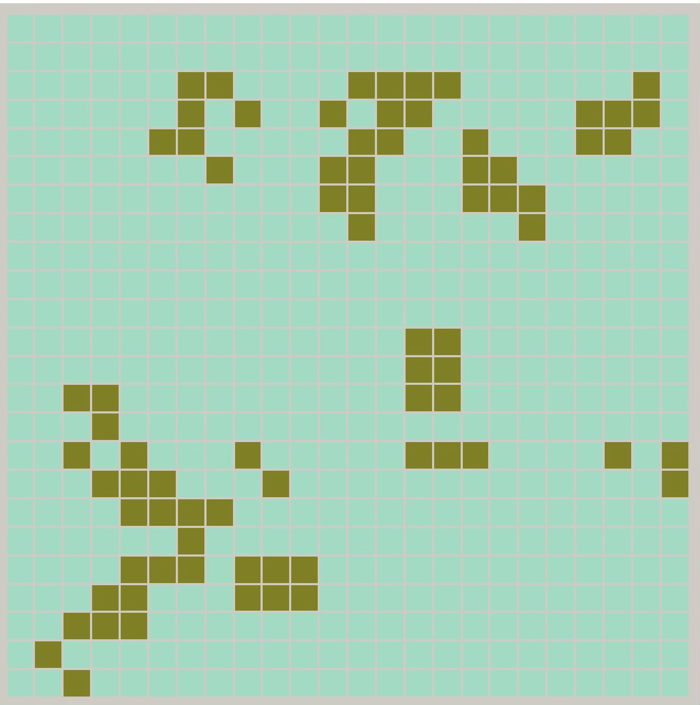

# Conway's Game of Life
The Game of Life, also known simply as Life, is a cellular automaton devised by the British mathematician 
John Horton Conway in 1970. It is a zero-player game, meaning that its evolution is determined by its initial 
state, requiring no further input. 

More details at Wikipedia: https://en.wikipedia.org/wiki/Conway%27s_Game_of_Life

## Demo

## Features

-- Explore nice patterns with button "Something beautiful".

-- Explore random patterns with button "Something beautiful". 

-- Set your own board size from boards with 12*12, 24*24, 36*36, 48*48 cells.

-- Choose your own web style with different colors.

#### Enjoy it!
